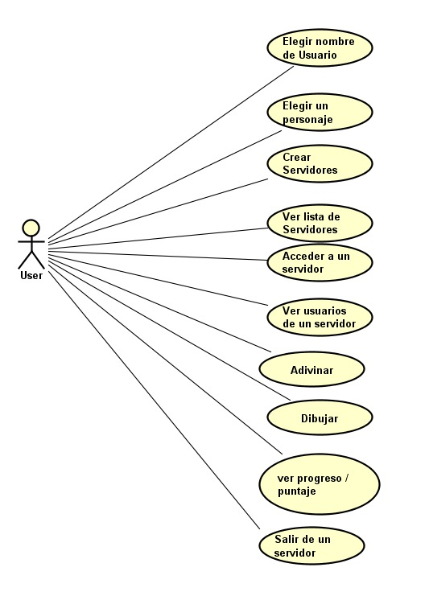
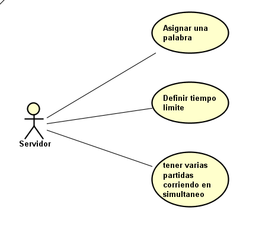
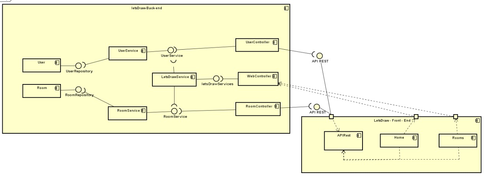
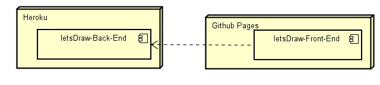
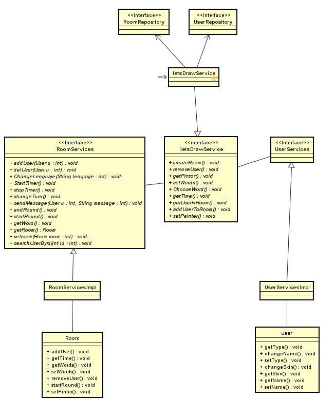

## Descripción Básica

Es un juego multijugador en tiempo real, basado en el juego pictionary, el cual cuenta con un sistema de turnos, donde un jugador se encarga de dibujar una palabra especifica definida por el sistema y el resto de jugadores se encarga de adivinarla, mientras mas rápido se adivine, más puntos se obtienen.

## Diagramas
### casos de uso

### diagrama de componentes

### diagrama de despliegue

### diagrama de clases

## Calidad de codigo y ci
### Back-end

### Front-end

